# Sobha CAPA Workflow

A web app to **log construction defects and get them approved** by quality checkers in a fixed order.

**CAPA** = Corrective And Preventive Action. Think of it as a ticket system for construction defects: a site supervisor raises a defect, and it must be approved level by level (Engineer → QCS → QAQC) before it is closed. An admin decides which levels each type of work needs.

---

## Tech Stack

| Part | Technology |
|---|---|
| Frontend | React 19 (Vite), React Router |
| Backend | Plain PHP 8 (no framework), REST-style JSON APIs |
| Database | MySQL 8 |
| Auth | Token based (random token stored in DB, sent as `Authorization: Bearer <token>`) |

---

## Installation (step by step)

### 1. Requirements
Install these first:
- **PHP 8.1+** with the `pdo_mysql` extension → check with `php -v`
- **MySQL 8** (or DBngin / XAMPP / MAMP) → must be running on port 3306
- **Node.js 18+** and npm → check with `node -v`
- **Git**

### 2. Clone the project
```bash
git clone https://github.com/tarunnjoshi/sobha-capa.git
cd sobha-capa
```

### 3. Create the database
This creates a database called `sobha_capa`, its tables, and sample data.

**Option A — Terminal**
```bash
mysql -h127.0.0.1 -uroot -p < backend/database/schema.sql
mysql -h127.0.0.1 -uroot -p < backend/database/seed.sql
```
(Press Enter at the password prompt if your root user has no password.)

**Option B — TablePlus / phpMyAdmin**
Open and run `backend/database/schema.sql`, then `backend/database/seed.sql`.

### 4. Set database credentials
Open `backend/config.php` and change the username/password if yours are different:
```php
'db_user' => 'root',
'db_pass' => '',
```

### 5. Start the backend (Terminal 1)
```bash
php -S localhost:8000 -t backend
```
Keep this running. Test it: open http://localhost:8000/api/login.php — you should see `{"error":"Use POST"}`.

### 6. Start the frontend (Terminal 2)
```bash
cd frontend
npm install
npm run dev
```

### 7. Open the app
Go to **http://localhost:5173** and log in with any user below.

### Test users
All users have the password: `password`

| Email | Role | What they can do |
|---|---|---|
| admin@sobha.test | Admin | Set which levels must approve each sub-activity |
| supervisor@sobha.test | Supervisor | Raise new CAPA requests (log defects) |
| engineer@sobha.test | Engineer | Approve / reject at level 1 |
| qcs@sobha.test | QCS | Approve / reject at level 2 |
| qaqc@sobha.test | QAQC | Approve / reject at level 3 (final) |

> To reset all data at any time, run step 3 again.

---

## How the app works (walkthrough)

The story of one defect, from the site to closure.

### Part A — Raising a defect (Supervisor)

#### 1. Login
Every user logs in with email and password. The sidebar menu changes based on the user's role.

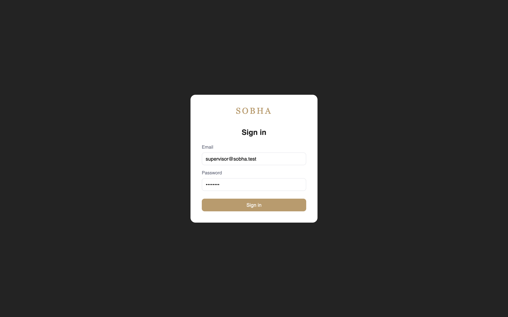

#### 2. Supervisor sees all CAPA requests
The supervisor (the person on site) sees every request with filters and a **+ Raise Request** button. Coloured dots show each approval step: 🟢 approved, 🟠 pending, 🔴 rejected.

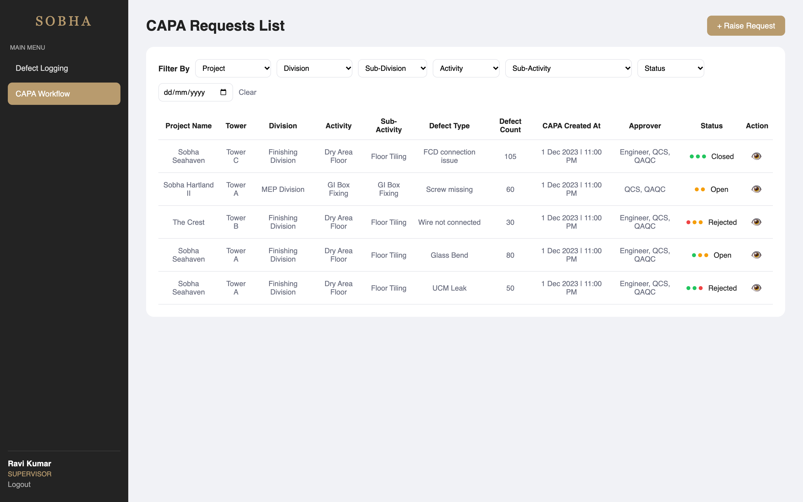

#### 3. Supervisor raises a defect
The supervisor finds leaking floor tiles and fills in the details. After choosing a sub-activity, the form shows the **approval flow** that will apply — here *Engineer → QCS → QAQC*.

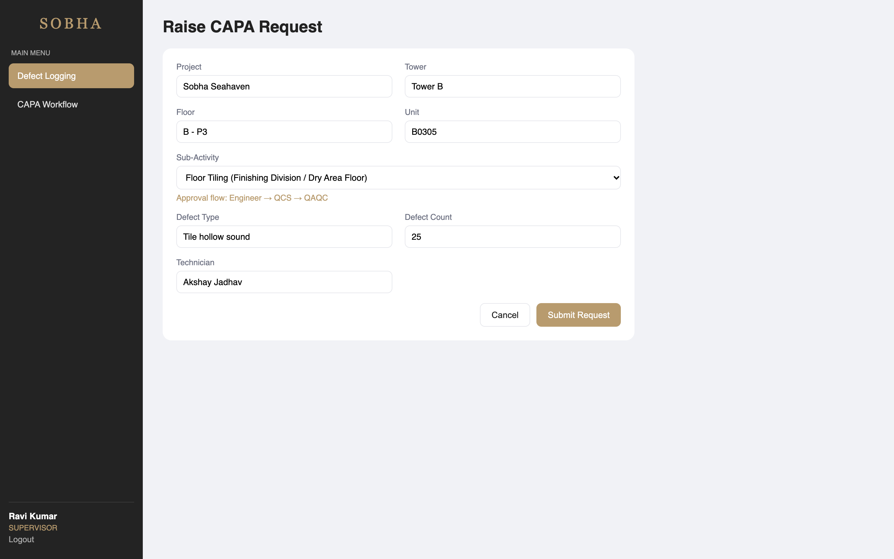

#### 4. The new request appears on top
Status is **Open** and all three steps are pending (🟠🟠🟠).

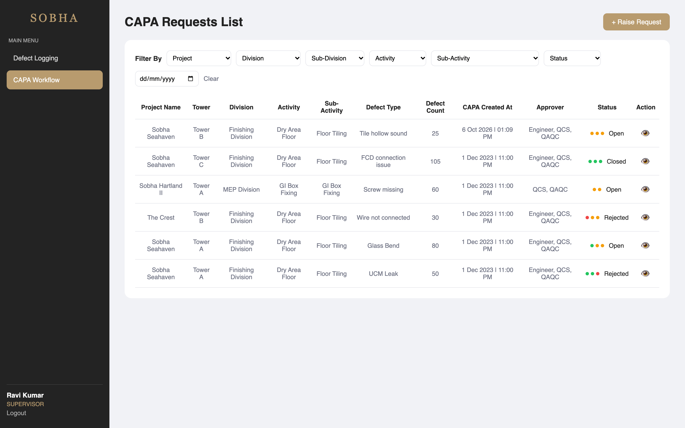

### Part B — Approval chain (Engineer → QCS → QAQC)

#### 5. Engineer sees what needs action
When the engineer logs in, requests waiting for them show an **Action Required** badge. "Only my pending" shows just those.

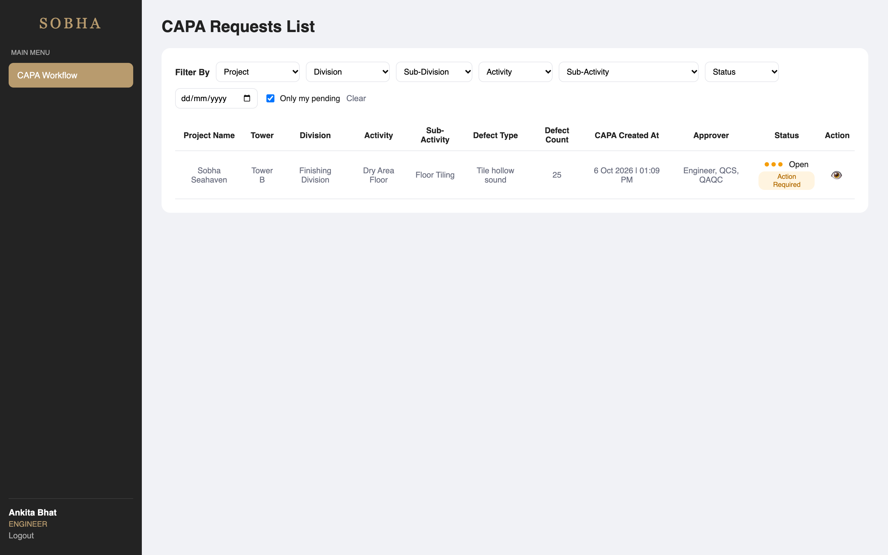

#### 6. Engineer reviews and approves
The detail page shows request info on the left and the approval timeline on the right. It's the engineer's turn, so they get a comment box with **Approve / Reject**.

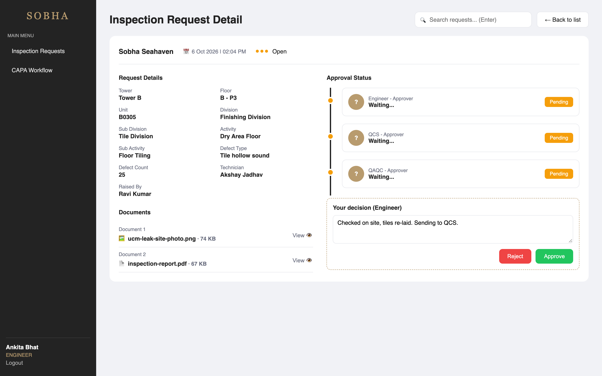

#### 7. QCS's turn
The engineer step is now ✅ with name, time and comment. The buttons move to QCS — nobody else can act out of order.

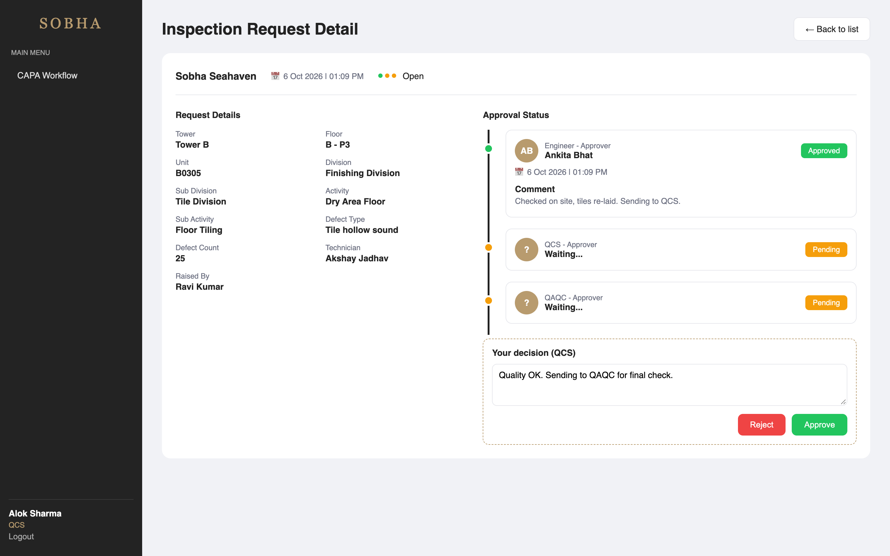

#### 8. QAQC gives final approval → Closed
After the last level approves, the request is **Closed**. The timeline is a full audit trail: who approved, when, and why.

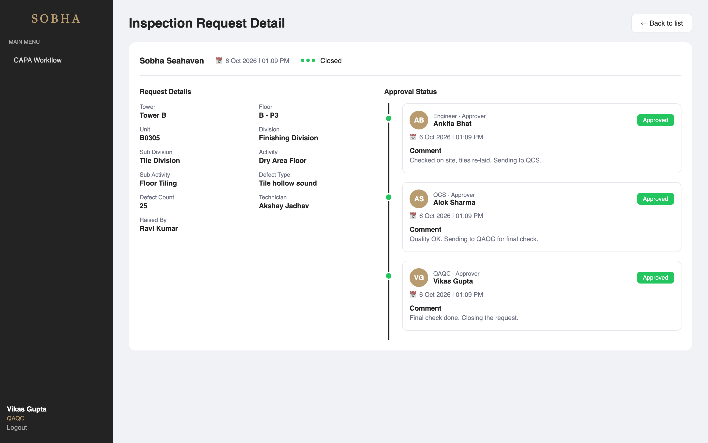

#### 9. When something is rejected
If any level rejects (a comment is required), the request becomes **Rejected** immediately and later levels are skipped.

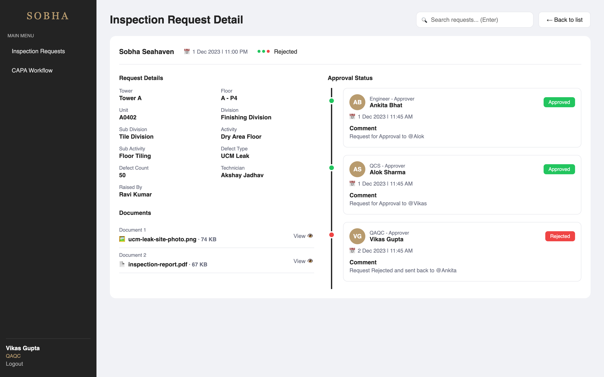

#### 10. Filtering the list
Managers can filter by project, division, sub-division, activity, sub-activity, status and date.

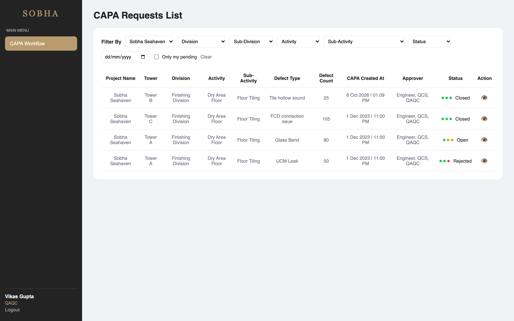

### Part C — Setting the rules (Admin)

#### 11. Inspection Configuration
The admin decides which levels must approve each type of work — ✅ required, ❌ not required. Risky work like *Floor Tiling* needs all three; simple work like *Ceiling First Coat* only QCS.

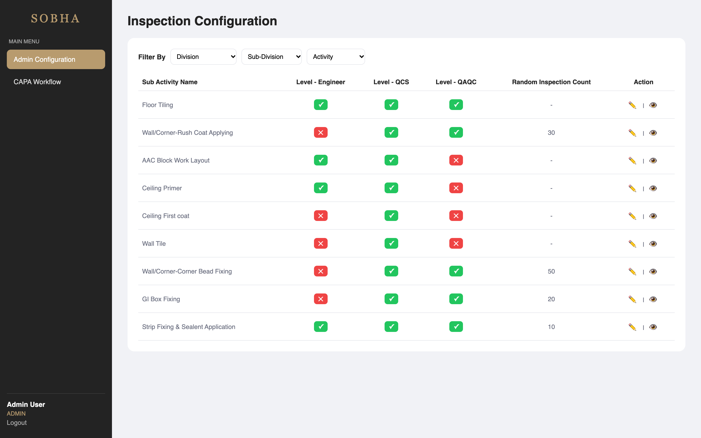

#### 12. Admin changes a rule
Clicking ✏️ makes the row editable. Here the admin makes *Wall Tile* also require the Engineer and sets a random inspection count.

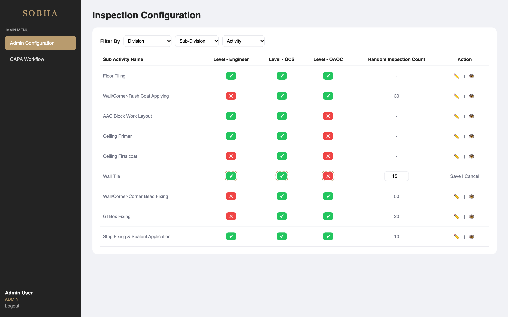

#### 13. The new rule is used immediately
When the supervisor now picks *Wall Tile*, the approval flow shows **Engineer → QCS**. Existing requests keep their original steps.

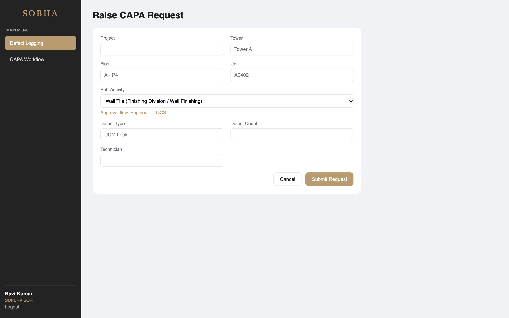

---

## Approval rules
1. When a request is raised, approval steps are created **only for the levels the admin marked ✅** for that sub-activity.
2. Steps must happen **in order**: Engineer → QCS → QAQC. A user can act only when it's their level's turn (enforced in the backend).
3. **Reject** at any level → request status `rejected`. A comment is required.
4. **Approve** at the last level → request status `closed`.
5. Changing a rule affects **new** requests only; existing requests keep their steps (history is not rewritten).

---

## Project Structure
```
sobha-capa/
├── backend/
│   ├── config.php            # database credentials
│   ├── helpers.php           # DB connection, JSON response, auth, role checks
│   ├── api/
│   │   ├── login.php         # POST  email+password → token
│   │   ├── me.php            # GET   current user
│   │   ├── logout.php        # POST  delete token
│   │   ├── capa-requests.php # GET   list (filters) / POST raise request
│   │   ├── capa-request.php  # GET   one request + approval timeline
│   │   ├── capa-action.php   # POST  approve / reject
│   │   ├── sub-activities.php# GET   config list / PUT update (admin)
│   │   └── filter-options.php# GET   dropdown values
│   └── database/
│       ├── schema.sql        # tables
│       └── seed.sql          # sample data
└── frontend/
    └── src/
        ├── main.jsx          # entry point
        ├── App.jsx           # routes + role protection
        ├── api.js            # fetch wrapper (adds token, handles errors)
        ├── AuthContext.jsx   # logged-in user state
        ├── utils.js          # date formatting, labels
        ├── components/Layout.jsx  # sidebar
        └── pages/            # Login, CapaList, CapaDetail, RaiseRequest, InspectionConfig
```

## Database Tables
| Table | Purpose |
|---|---|
| `users` | People who log in, with a role |
| `user_tokens` | Login sessions |
| `sub_activities` | Inspection configuration (which levels approve each type of work) |
| `capa_requests` | Defect requests |
| `approvals` | One row per approval step of a request (the timeline) |

## Security
- Passwords stored as bcrypt hashes (`password_hash` / `password_verify`).
- All SQL uses prepared statements (prevents SQL injection).
- Every API checks the token; role checks (`require_role`) are done in PHP, not only hidden in the UI.
- Multi-step writes (raise request, approve) use database transactions.

## Possible Improvements
- Email / push notification when a request needs someone's action
- File uploads (photos of the defect)
- Per-project approval rules
- Pagination for large lists
- Token expiry

---

## Built with AI assistance
This project was built with the help of an AI coding assistant (Claude Code) for planning, code generation and review, step by step, with every part reviewed and tested manually.
