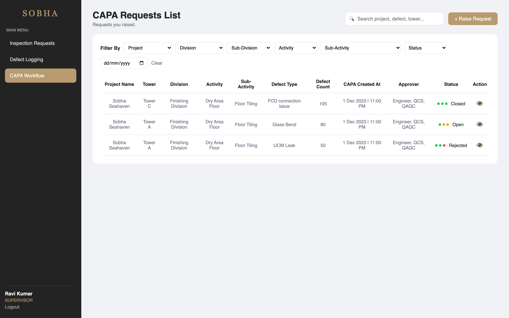
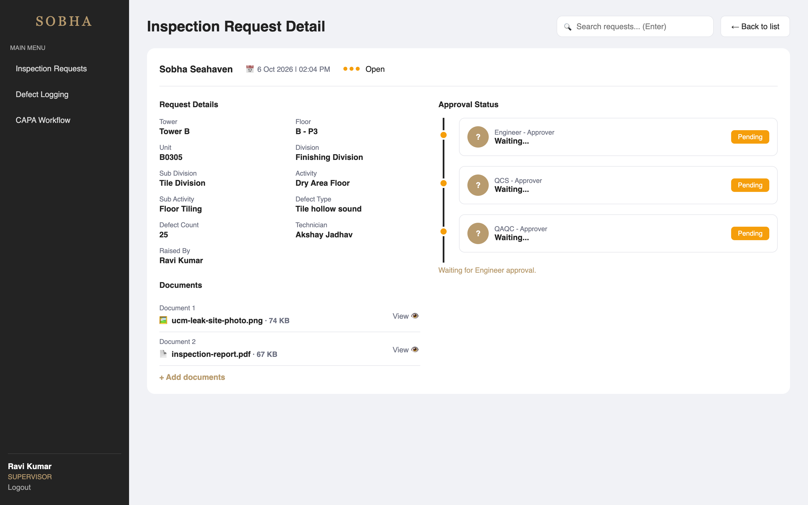
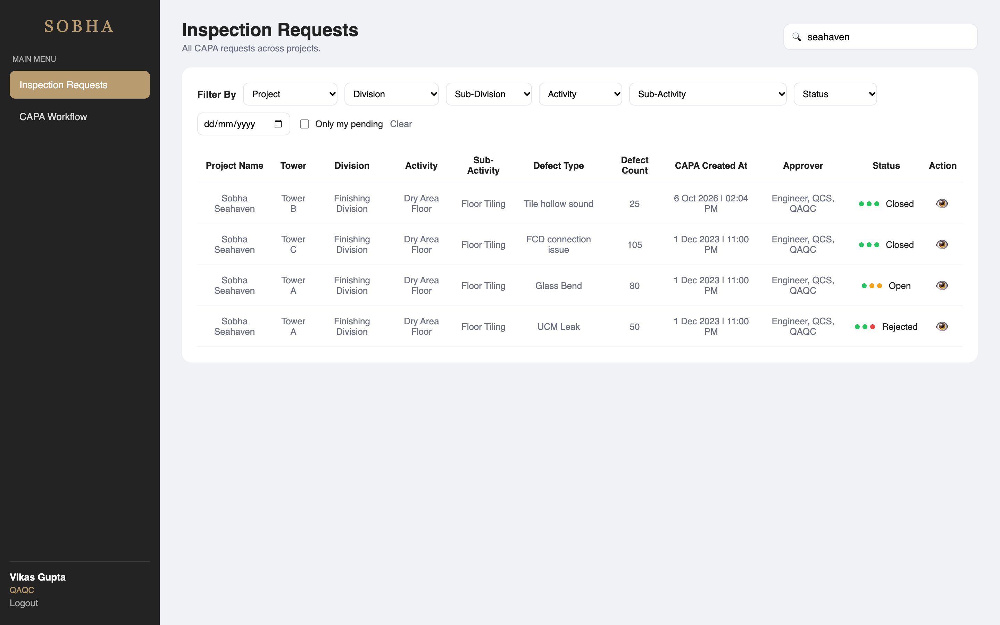
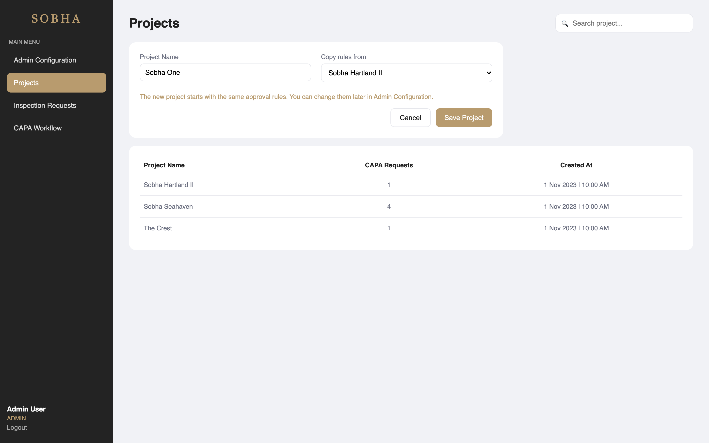
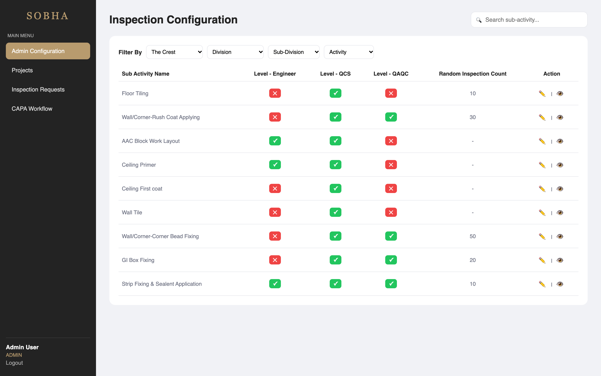
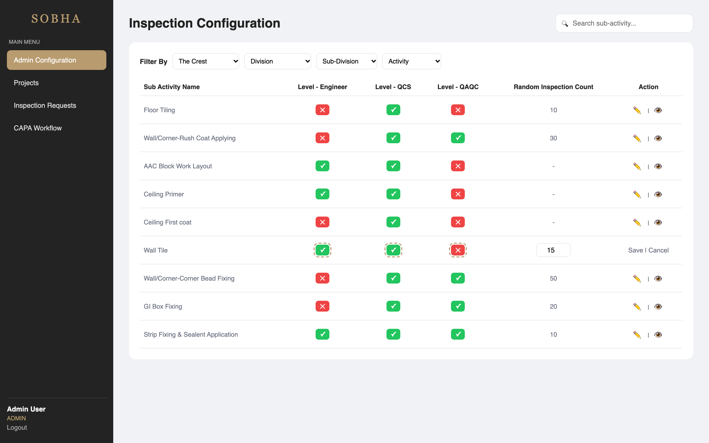
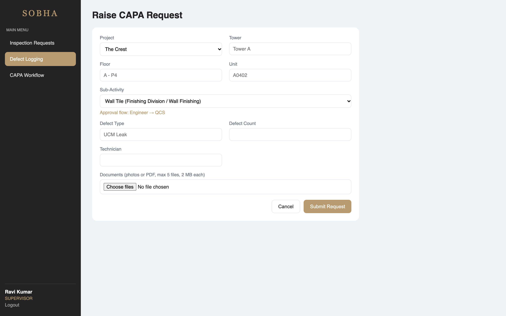

# Sobha CAPA Workflow

A web app to **log construction defects and get them approved** by quality checkers in a fixed order.

**CAPA** = Corrective And Preventive Action. Think of it as a ticket system for construction defects: a site supervisor raises a defect (with photos / documents), and it must be approved level by level (Engineer → QCS → QAQC) before it is closed. An admin manages projects and decides, **per project**, which levels each type of work needs.

---

## Features

| Area | What it does |
|---|---|
| **Login & roles** | Token-based login. 5 roles (Admin, Supervisor, Engineer, QCS, QAQC); menus, pages and APIs are restricted by role |
| **Defect Logging** | Supervisor raises a CAPA request and attaches photos / PDFs. The form shows the approval flow that will apply |
| **Approval workflow** | Engineer → QCS → QAQC, in order, with comments. Reject at any level ends the flow; final approval closes the request |
| **Inspection Requests** | Every request in the system (monitoring view) |
| **CAPA Workflow** | Only *my* work: requests I raised (supervisor) or that pass through my level (approvers), with an **Action Required** badge |
| **Request detail** | Request info, documents, and an approval timeline (who, when, comment) |
| **Projects** | Admin adds projects, optionally copying approval rules from an existing project |
| **Inspection Configuration** | Admin sets, per project, which levels must approve each sub-activity |
| **Search & filters** | Search box on every page + filters (project, division, sub-division, activity, sub-activity, status, date) |

---

## Tech Stack

| Part | Technology |
|---|---|
| Frontend | React 19 (Vite), React Router |
| Backend | PHP 8 (no framework), REST-style JSON APIs |
| Database | MySQL 8 |
| Auth | Token based (random token stored in DB, sent as `Authorization: Bearer <token>`) |
| Files | Uploaded to `backend/uploads/`, metadata in the `documents` table |

---

## Installation (step by step)

### 1. Requirements
- **PHP 8.1+** with `pdo_mysql` and `fileinfo` → check with `php -m`
- **MySQL 8** (or DBngin / XAMPP / MAMP) running on port 3306
- **Node.js 18+** and npm → check with `node -v`
- **Git**

### 2. Clone the project
```bash
git clone https://github.com/tarunnjoshi/sobha-capa.git
cd sobha-capa
```

### 3. Create the database
Creates the `sobha_capa` database, its tables and sample data.

**Option A — Terminal**
```bash
mysql -h127.0.0.1 -uroot -p < backend/database/schema.sql
mysql -h127.0.0.1 -uroot -p < backend/database/seed.sql
```
(Press Enter at the password prompt if your root user has no password.)

**Option B — TablePlus / phpMyAdmin**
Open and run `backend/database/schema.sql`, then `backend/database/seed.sql`.

### 4. Set database credentials
Open `backend/config.php` and change the username/password if yours are different:
```php
'db_user' => 'root',
'db_pass' => '',
```

### 5. Start the backend (Terminal 1)
```bash
php -d upload_max_filesize=2M -d post_max_size=12M -d display_errors=0 -d log_errors=1 -S localhost:8000 -t backend
```
The `-d` flags set the upload limits (2 MB per file, 5 files per upload) and keep PHP warnings in the terminal instead of inside API responses.

Test it: open http://localhost:8000/api/login.php — you should see `{"error":"Use POST"}`.

### 6. Start the frontend (Terminal 2)
```bash
cd frontend
npm install
npm run dev
```

### 7. Open the app
Go to **http://localhost:5173** and log in with any user below.

### Test users
All users have the password: `password`

| Email | Role | What they can do |
|---|---|---|
| admin@sobha.test | Admin | Manage projects and approval rules; sees everything |
| supervisor@sobha.test | Supervisor (Ravi) | Raise CAPA requests, attach documents |
| supervisor2@sobha.test | Supervisor (Neha) | A second supervisor, to show "my work" vs all requests |
| engineer@sobha.test | Engineer | Approve / reject at level 1 |
| qcs@sobha.test | QCS | Approve / reject at level 2 |
| qaqc@sobha.test | QAQC | Approve / reject at level 3 (final) |

> To reset all data at any time, run step 3 again.

### Run the API tests (optional)
64 end-to-end checks covering every feature, including permission and validation errors. No packages needed.
```bash
node tests/api-test.mjs
```
The tests raise and approve requests, so reset the database (step 3) before each run.

---

## How the app works (walkthrough)

The story of one defect, from the site to closure.

### Part A — Raising a defect (Supervisor)

#### 1. Login
Every user logs in with email and password. The sidebar menu changes based on the role.


#### 2. Supervisor's CAPA Workflow
Ravi (site supervisor) opens **CAPA Workflow** and sees the requests **he raised**, with a search box and filters. Coloured dots show each approval step: 🟢 approved, 🟠 pending, 🔴 rejected.



#### 3. Raising a defect with documents
He picks the **project** and **sub-activity**, and the form shows the approval flow from that project's rules — here *Engineer → QCS → QAQC*. He attaches a site photo and an inspection report (JPG / PNG / PDF, up to 5 files, 2 MB each).


#### 4. The request is created
The new request opens with its **documents** (view any of them with 👁) and a timeline where every step is pending. The supervisor who raised it can add more documents later.



### Part B — Approval chain (Engineer → QCS → QAQC)

#### 5. Engineer sees what needs action
In **CAPA Workflow**, requests waiting for the engineer show **Action Required**. "Only my pending" narrows the list to just those.


#### 6. Engineer reviews and approves
It's the engineer's turn, so they get a comment box with **Approve / Reject**. Nobody else can act on this step.


#### 7. QCS's turn
The engineer step is now ✅ with name, time and comment. The buttons move to QCS. (Rejecting requires a comment.)


#### 8. QAQC gives final approval → Closed
After the last level approves, the request is **Closed**. The timeline is a full audit trail.


#### 9. When something is rejected
If any level rejects, the request becomes **Rejected** immediately and later levels are skipped.


### Part C — Monitoring

#### 10. Inspection Requests — every request, searchable
**Inspection Requests** lists all requests across projects. The search box matches project, tower, unit, division, activity, sub-activity, defect type and technician, and works together with the filters.



### Part D — Setting things up (Admin)

#### 11. Projects
The admin adds new projects. **"Copy rules from"** starts the project with the approval rules of an existing one (or empty, all ❌).



#### 12. Approval rules per project
In **Admin Configuration** the admin picks a project and sees **that project's** rules. Here *The Crest* is lighter than *Sobha Seahaven*: Floor Tiling needs only QCS.



#### 13. Editing a rule
Clicking ✏️ makes the row editable: toggle levels, set the random inspection count, save. Only the selected project changes.



#### 14. The new rule is used immediately
When the supervisor now picks *The Crest → Wall Tile*, the flow shows **Engineer → QCS**. Existing requests keep the steps they were created with.



---

## Design Decisions & Assumptions

The design screens don't define every behaviour. Where they were unclear, these are the decisions I made and why.

### 1. Who raises a CAPA request? → a **Supervisor** role
The screens show approvers and an admin, but not who creates a request. A site supervisor finds defects, so I added a **Supervisor** role and stored `created_by` on every request.

### 2. "Inspection Requests" vs "CAPA Workflow"
The sidebar has both menus, but the design shows only one list. I made them two views of the same data:

| Menu | Shows | Why |
|---|---|---|
| **Inspection Requests** | **All** requests | Monitoring: anyone can see the state of every request |
| **CAPA Workflow** | **My work** — supervisor: requests I raised; approvers: requests that pass through my level; admin: all | Each person sees their own queue instead of everything |

Same idea as "All Mail" vs "Inbox". One React component serves both pages; the backend applies the scope (`?scope=mine`).

### 3. Approval rules are **per project**
The configuration screen has a **Project filter** but **no Project column**. That suggests: *pick one project, then see and edit that project's rules*. So rules live in a `project_rules` table (project + sub-activity → required levels), and different projects can have different quality standards (e.g. a luxury project is stricter).

### 4. Where do projects come from? → a **Projects** screen
Per-project rules need a way to add projects, so the admin has a Projects page. A new project can **copy rules** from an existing one, so it's usable immediately.

### 5. Documents
The detail screen shows "Document 1 / Document 2 — View". I added uploads when raising a request (JPG, PNG, PDF; 2 MB each; up to 5). The supervisor who raised a request can add more later; everyone can view them.

### 6. Rule changes don't rewrite history
When a request is raised, its approval steps are **copied** from the rules at that moment. Changing a rule later only affects new requests — an approval already in progress isn't changed under people's feet.

---

## Approval Rules (workflow logic)
1. When a request is raised, approval steps are created **only for the levels marked ✅ for that project + sub-activity**.
2. Steps happen **in order**: Engineer → QCS → QAQC. A user can act only when it's their level's turn (enforced in the backend).
3. **Reject** at any level → request `rejected` (comment required).
4. **Approve** at the last level → request `closed`.
5. Changing a rule affects **new** requests only.

---

## Project Structure
```
sobha-capa/
├── backend/
│   ├── config.php              # database credentials
│   ├── helpers.php             # DB connection, JSON responses, auth, role checks, workflow helper
│   ├── api/
│   │   ├── login.php           # POST  email + password → token
│   │   ├── me.php              # GET   current user
│   │   ├── logout.php          # POST  delete token
│   │   ├── capa-requests.php   # GET   list (filters, search, scope=mine) / POST raise request
│   │   ├── capa-request.php    # GET   one request + timeline + documents
│   │   ├── capa-action.php     # POST  approve / reject
│   │   ├── documents.php       # POST  upload files / GET view a file
│   │   ├── projects.php        # GET   list / POST add project (admin)
│   │   ├── sub-activities.php  # GET   rules for a project / PUT update a rule (admin)
│   │   └── filter-options.php  # GET   dropdown values
│   ├── database/
│   │   ├── schema.sql          # tables
│   │   ├── seed.sql            # sample data
│   │   └── sample-docs/        # sample photos / PDF used by the seed
│   └── uploads/                # uploaded documents (not committed)
├── frontend/src/
│   ├── main.jsx                # entry point
│   ├── App.jsx                 # routes + role protection
│   ├── api.js                  # fetch wrapper (token, errors, file upload/download)
│   ├── AuthContext.jsx         # logged-in user state
│   ├── utils.js                # formatting, debounce hook, file checks
│   ├── components/             # Layout (sidebar), SearchBox, DocumentList
│   └── pages/                  # Login, CapaList, CapaDetail, RaiseRequest,
│                               # InspectionConfig, Projects
├── tests/api-test.mjs          # end-to-end API tests
└── screenshots/
```

## Database Tables
| Table | Purpose |
|---|---|
| `users` | People who log in, with a role |
| `user_tokens` | Login sessions |
| `projects` | Construction projects |
| `sub_activities` | Types of work (Division → Sub-Division → Activity → Sub-Activity) |
| `project_rules` | Which levels must approve each sub-activity **in each project** |
| `capa_requests` | Defect requests |
| `approvals` | One row per approval step of a request (the timeline) |
| `documents` | Files attached to a request |

```
projects ──< project_rules >── sub_activities
    │                               │
    └──────< capa_requests >────────┘
                 │       │
        approvals ┘       └ documents
```

## Security
- Passwords stored as bcrypt hashes (`password_hash` / `password_verify`).
- All SQL uses prepared statements (prevents SQL injection); filter and search columns come from fixed lists.
- Every API checks the token; role checks (`require_role`) run in PHP, not only in the UI.
- Uploads: file type checked from the **content** (not the name), size limits, random file names on disk, files served only to logged-in users.
- Multi-step writes (raise request, approve, add project) use database transactions.

## Possible Improvements
- Email / push notification when a request needs someone's action
- Edit / archive projects and manage users from the UI
- Pagination for large lists
- Token expiry and refresh
- Cloud storage (e.g. S3) for documents

---

## How I Built This (AI-assisted development)

I used an AI coding assistant (Claude Code) as a pair programmer. I owned the product thinking, architecture decisions and review; the AI helped write code for each step I planned. Below is how the work was split.

### My role — product, architecture and review
- **Understood the domain first.** Before writing code, I mapped out who uses the system and why: what CAPA means, what each role does, and how a defect moves from the site to closure.
- **Found a gap in the workflow.** The design screens only showed approvers. I asked *"who actually creates a CAPA request?"* — which led to adding the **Supervisor** role and a `created_by` field, so every request has an owner.
- **Defined how approvers know there's work.** I asked how an engineer finds out something is waiting for them, which became the **"Action Required"** badge and the **"Only my pending"** filter.
- **Chose role-based login** to make the architecture realistic (Admin, Supervisor, Engineer, QCS, QAQC), instead of a demo without authentication.
- **Added Approve / Reject actions** so the workflow actually works end to end, not just displays data.
- **Audited the build against the design** and insisted every element be implemented rather than skipped: search, documents, the Inspection Requests menu and the Project filter.
- **Resolved what the design left unclear** — decided what "Inspection Requests" vs "CAPA Workflow" should mean, and read the Project-filter-without-a-Project-column as per-project rules (see *Design Decisions*).
- **Asked "who adds the projects?"**, which led to the Projects screen with "copy rules from".
- **Checked the sample data tells a clear story** — e.g. added a second supervisor so "my work" vs "all requests" is visibly different.
- **Chose the stack deliberately:** React for a component-driven UI; framework-free PHP with a thin helper layer (DB, auth, role guards, JSON responses) to keep the API lightweight with zero dependencies; and **MySQL** as a production-grade relational database with foreign keys, transactions and ENUM constraints — matching how this would run in a real deployment.
- **Designed for maintainability:** minimal dependencies, clear separation of concerns (one endpoint per resource, shared helpers, a single API client and auth context on the frontend), and business rules enforced in one place on the backend — so the codebase is easy to extend and review.
- **Planned the build order:** database → API (tested with curl) → frontend shell → one screen at a time, reviewing each step before moving on.
- **Tested every step myself:** ran the SQL, tested each API with curl, checked data in TablePlus, and clicked through every role in the browser. The final build is also covered by an automated API test suite (`tests/api-test.mjs`), which caught a real upload-limit bug before submission.
- **Shaped the documentation:** structured the walkthrough as a user story (Supervisor → approvers → Admin) so a reader understands the product, not just the screens.

### AI's role — implementation support
- Wrote code for each step based on my decisions, with comments explaining it
- Suggested patterns (token auth, transactions, prepared statements) which I reviewed and understood before accepting
- Helped with debugging, automated tests, the README and screenshots

### How I used AI output
I didn't accept AI-generated code blindly. For every step I:
- **Reviewed the code manually** — read each file, checked the logic against the workflow rules, and asked for changes where the design didn't fit (e.g. the missing Supervisor role)
- **Verified behaviour, not just syntax** — tested each API with curl (success, validation errors, 401/403 cases) and checked the resulting rows in MySQL
- **Tested every role end to end** in the browser before moving to the next step
- **Moved forward only after a step was working and understood**

### Process
```
Understand the problem → Decide roles & workflow → Design tables
→ Build & test API (curl) → Build UI screen by screen → Test each role end to end
→ Audit against the design → Fill the gaps → Automated tests → Document
```
